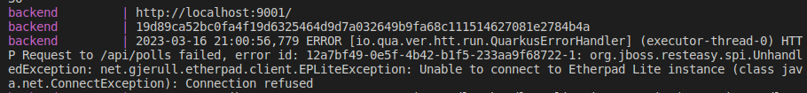

Emma CHAPUIS - M2 ILA

# PROJET DE TLC

Réalisé : 
- question 0
- question 1
- tentatives de question 2

Plus le temps et l'énergie d'aller plus loin à cause du disfonctionnement de la question 2. Sans cet acharnement sur la question 2 j'aurais surement pû essayer d'aller plus loin avec Interceptor.

Problème rencontré : impossible de faire communiquer le back et etherpad

Tentatives pour la question 2 :
1) retirer le git clone du Dockerfile du back
2) ajouter des environment pour surcharger les variables de la db, de myadmin et d'etherpad
3) rajouter myadmin.tlc.fr, pad.tlc.fr et doodle.tlc.fr dans /etc/hosts dans les adresses à rediriger vers 127.0.0.1
4) ajouter un restart : always à tous les blocs du docker compose
5) rajouter des champs hostname pour tous les blocs du docker compose
6) tester de mettre exactement la structure du projet et toutes les infos du docker compose ainsi que du Dockerfile du back comme dans les vidéos explicatives présentes sur la page du cours
7) exposer le port d'etherpad pour vérifier qu'on peut bien y accéder, ce qui est bien le cas comme montré ci-dessous, mais malgré tout accès refusé à l'etherpad si le back essaie de se connecter donc aucune idée d'où ça viendrait et abandon du Dockerfile 

8) réaliser un Dockerfile.native.x64 comme la base servant à la suite du tp dans les vidéos (la version d'image utilisée dans la vidéo n'est pas trouvable par le programme donc utilisation de la plus récente mais ensuite le programme ne trouve pas la commande gu alors qu'il devrait donc sentiment de perte de temps et abandon)
9) demande d'aide à Marion et Raphaël qui ont pu faire fonctionner cette partie mais ils n'ont pas trouvé où ça pourrait coincer non plus (de même pour Léo qui n'a pas pu non plus faire fonctionner le code sur sa machine) -> abandon définitif, trop de stress vis à vis de la réussite du projet
